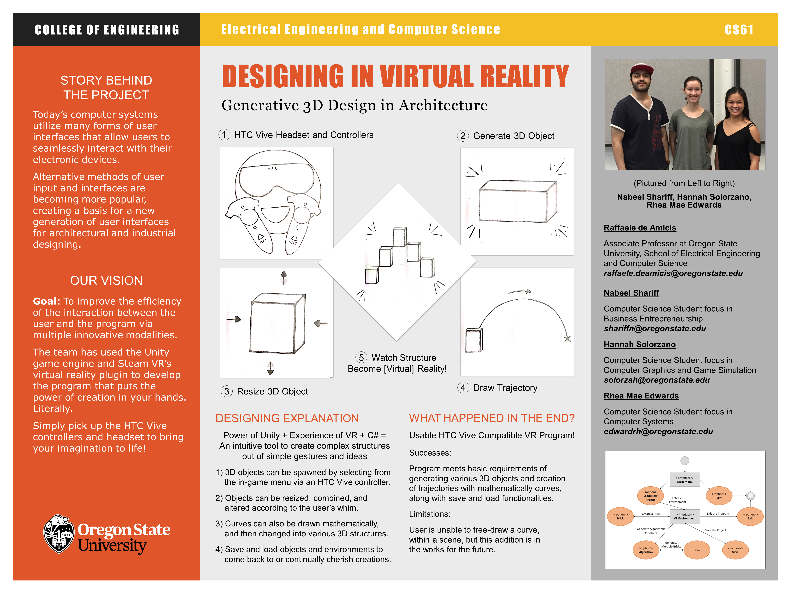

# iCreate

  This is a virtual reality program designed to create generative designed architecture. 
  iCreate was developed using Unity (https://unity3d.com/) for the HTC Vive with development support by SteamVR. 
  The motion sensing software Leap Motion (https://www.leapmotion.com/) is used to capture hand movement which 
  allows the user to forego controllers and use their hands to create shapes and designs.
  
# Capstone Members:

  solorzah - Hannah Solorzano
  
  shariffn - Nabeel Shariff
  
  edwardrh - Rhea Mae Edwards

# Overall Project Description and Background

The purpose of this project is to develop a VR application that allows users to create complex 3D objects by 
seamlessly creating simpler objects and combining them to form intricate structures.
  
The virtual reality (VR) application will utilize a virtual reality headset with input from the user via a 
controller recognition software. The VR headset will be used to look around in virtual space while the controllers' 
recognition software will be used by the user to draw curves. The application will also need to utilize the GPU in 
a computer to both run the VR application and render 3D objects in the virtual space. Additionally, the 3D modelling 
will be based on generative design techniques, and the assembly of the complex 3D designs will utilize mathematical 
equations and algorithms to derive the appropriate structure of the design.
  
The outcome of this Oregon State University computer science senior capstone project is a virtual reality program 
that allows the user to utilize generative design to develop complex architectural structure.

 

 

  
# Roman Aqueduct Example:

